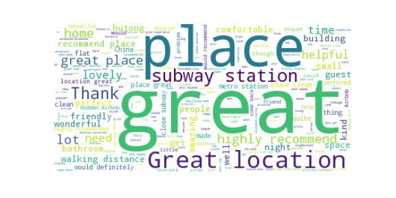

# Airbnb_Beijing
## Project 1: Look into Airbnb Beijing Data

### Project summary: 
When I choose an Airbnb, I always see the scores and reviews to make my decisions. In this project, I want to see if it's a common behavior based on Airbnb Data. There're three questions I tried to answer.  
1. Does score influence availability?  
2. If yes, how to improve scores?
3. How to improve availability based on reviews?

To reduce other elements' affect as much as possible like season, I choose unavailability in 30 days as response variable. After applying linear regression to all quantitative data, including neighbourhood, room type, price, review scores rating, reviews per month, number of reviews ltm, property type and response, the coefficient of review scores rating is the highest among all the categories, which means a place with higher score attracts more users. Due to all the collected scores, review scores rating, review scores accuracy, review scores cleanliness, review scores checking, review scores communication, review scores location, and review scores value, review scores value have the highest correlation with review scores rating.   
  
In this case, if the service a host gave mathch the price would lead to higher rating score. Based on all reviews, the words show most times are related to good location and friendly host.    

  

This folder is orgarnized as follows.

```
proj/
├── source/
├── pic/
├── code
├── READMe.md
```

References used:  
1. http://insideairbnb.com/get-the-data.html : Airbnb Data Source 
